## Text common style
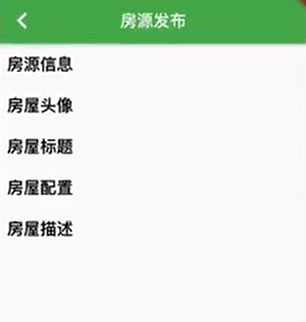


```dart
Container(
      height: 50.0,
      padding: EdgeInsets.only(left: 10.0),
      alignment: Alignment.centerLeft,
      child: Text(
        title,
        style: TextStyle(
            fontWeight: FontWeight.w600, color: Colors.black, fontSize: 20.0),
      ),
    );
```

## 制作grid layout
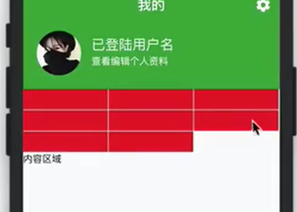

```dart
class FunctionButton extends StatelessWidget {
  const FunctionButton({Key key}) : super(key: key);

  @override
  Widget build(BuildContext context) {
    return Container(
      child: Wrap(
        spacing: 1.0,
        runSpacing: 1.0,
        children: list.map((item) => Container(
            height: 20.0, width: MediaQuery.of(context).size.width*0.3,
            decoration: BoxDecoration(color: Colors.red),
        ),
      ),
    );
  }
}
```


## TabBar view + Tabbar Controller


```dart
 @override
  Widget build(BuildContext context) {
    return DefaultTabController(
      length: 2,
      initialIndex: 0,
      child: Scaffold(
        appBar: AppBar(
          title: Text('房屋管理'),
          bottom: TabBar(
            tabs: <Widget>[
              Tab(
                text: '空置',
              ),
              Tab(
                text: '已租',
              )
            ],
          ),
        ),
        body: TabBarView(
          children: <Widget>[
            ListView(
              children: availableDataList
                  .map((item) => RoomListItemWidget(item))
                  .toList(),
            ),
            ListView(
              children: List(),
              // dataList.map((item) => RoomListItemWidget(item)).toList(),
            ),
          ],
        ),
      ),
    );
```

## Expanded/Box border 用法

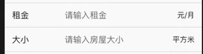

```dart
Container(
      padding: EdgeInsets.only(left: 14.0, right: 14.0),
      decoration: BoxDecoration(
          border: Border(
            // 只有下划线
              bottom: BorderSide(
                  width: 1.0, color: Theme.of(context).dividerColor))),
      child: Row(
        children: <Widget>[
          Container(
            width: 100.0,
            child: Text(
              label,
              style: TextStyle(fontSize: 16.0, color: Colors.black87),
            ),
          ),
          // 用掉剩余空间
          Expanded(
            child: contentBuilder != null
                ? contentBuilder(context)
                : TextField(
                  // 控制器
                    controller: controller,
                    decoration: InputDecoration(
                      border: InputBorder.none,
                      hintText: hintText,
                    ),
                  ),
          ),
          if (suffix != null) suffix,
          if (suffix == null && suffixText != null) Text(suffixText)
        ],
      ),
    );
```

## 不处理空白点击


```dart
child: GestureDetector(
    behavior: HitTestBehavior.translucent,

```
## RadioForm 
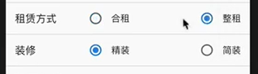

```dart
CommonRadioFormItem(
                  label: '租赁方式',
                  options: ['合租', '整租'],
                  // setstate 后触发value的改变
                  value: rentType,
                  onChange: (index) {
                    setState(() {
                      // 点击事件触发
                      rentType = index;
                    });
                  })

Container(
          child: Row(
            mainAxisAlignment: MainAxisAlignment.spaceBetween,
            // 可以返回index的 List.generate
            children: List.generate(
                options.length,
                (index) => Row(
                      children: <Widget>[
                        Radio(
                          //options.length
                          value: index,
                          //触发的rentType
                          groupValue: value,
                          onChanged: onChange,
                        ),
                        Text(options[index])
                      ],
                    )),
          ),
        );
```

## Popup window picker
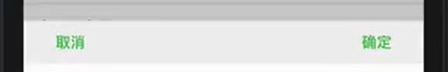

```dart
                   // 返回一个数值
showCupertinoModalPopup<int>(
        context: context,
        builder: (BuildContext context) {
          var buttonTextStyle = TextStyle(
              color: Theme.of(context).primaryColor,
              fontWeight: FontWeight.w600);

          var controller = FixedExtentScrollController(initialItem: value);
          return Container(
            color: Colors.grey,
            height: height,
            child: Column(
              children: <Widget>[
                Container(
                  color: Colors.grey[200],
                  height: 40.0,
                  child: Row(
                    mainAxisAlignment: MainAxisAlignment.spaceBetween,
                    children: <Widget>[
                      FlatButton(
                        onPressed: () {
                          Navigator.of(context).pop();
                        },
                        child: Text(
                          '取消',
                          style: buttonTextStyle,
                        ),
                      ),
                      FlatButton(
                        onPressed: () {
                          Navigator.of(context).pop(controller.selectedItem);
                        },
                        child: Text(
                          '确定',
                          style: buttonTextStyle,
                        ),
                      ),
                    ],
                  ),
                ),
```
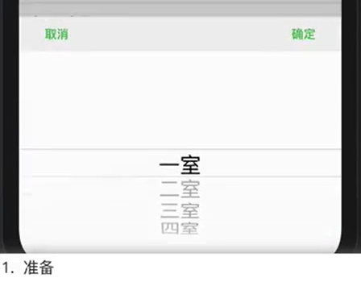

```dart
                Expanded(
                  child: CupertinoPicker(
                    scrollController: controller,
                    backgroundColor: Theme.of(context).scaffoldBackgroundColor,
                    itemExtent: 32.0, // 单个的高度
                    onSelectedItemChanged: (val) {},
                    // label的值
                    children: options.map((item) => Text(item)).toList(),
                  ),
                )
              ],
            ),
          );
        });

```

## 添加读取文件权限依赖

ios/Runner/Info.plist
```xml
  <string>Use to get room image </string>
	<key>NSMicrophoneUsageDescription</key>
	<string>Use to capture audio for room</string>
	<key>NSPhotoLibraryUsageDescription</key>
	<string>Use to get room image</string>
```


## 图片选取

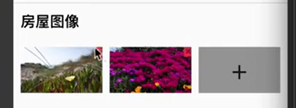


```dart
 List<File> files = [];

// 异步加载图片
  _pickImage() async {
    var image = await ImagePicker.pickImage(source: ImageSource.gallery);
    if (null == image) return;
    setState(() {
      files = files..add(image);
    });
    if (widget.onChange != null) {
      widget.onChange(files);
    }
  }

   Widget addButton = GestureDetector(
      onTap: () {
        // 点击事件
        _pickImage();
      },
      behavior: HitTestBehavior.translucent,
      child: Container(
        width: width,
        height: height,
        color: Colors.grey,
        child: Center(
          child: Text('+',
              style: TextStyle(fontSize: 40.0, fontWeight: FontWeight.w100)),
        ),
      ),
    );


    Widget wrapper(File file) {
      // 图片重叠
      return Stack(
        overflow: Overflow.visible,
        children: <Widget>[
          // 
          Image.file(file, width: width, height: height, fit: BoxFit.cover),
          // 悬浮组件
          Positioned(
            // 位置调在右上角
            right: -20.0,
            top: -20.0,
            child: IconButton(
              onPressed: () {
                setState(() {
                  files = files..remove(file);
                });
                if (null != widget.onChange) {
                  widget.onChange(files);
                }
              },
              icon: Icon(
                Icons.delete_forever,
                color: Colors.red,
              ),
            ),
          )
        ],
      );
    }

```

## Multiple choose

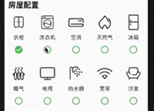

```dart
Container(

      child: Wrap(
        runSpacing: 30.0,
        children: list
            .map((item) => GestureDetector(
                  onTap: () {
                    setState(() {
                      // 若是被选中的item item check 参数取反
                      list = list
                          .map((innerItem) => innerItem == item
                              ? RoomApplianceItem(
                                  item.title, item.iconPoint, !item.isChecked)
                              : innerItem)
                          .toList();
                    });

                    if (null != widget.onChange) {
                      widget.onChange(list);
                    }
                  },
                  behavior: HitTestBehavior.translucent,
                  child: Container(
                    // 一行5个
                    width: MediaQuery.of(context).size.width / 5,
                    child: Column(
                      children: <Widget>[
                        Icon(
                          IconData(item.iconPoint,
                              fontFamily: Config.CommonIcon),
                          size: 40.0,
                        ),
                        Padding(
                          padding: const EdgeInsets.all(10.0),
                          child: Text(item.title),
                        ),
                        CommonCheckButton(item.isChecked)
                      ],
                    ),
                  ),
                ))
            .toList(),
      ),
    );
```


## 提交页的封装


```dart
```

## 展示、收起

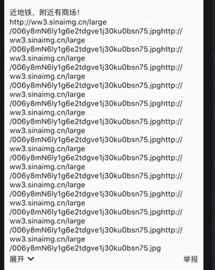

```dart
bool showAllText = false;
child: Column(
                  crossAxisAlignment: CrossAxisAlignment.start,
                  children: <Widget>[
                    Text(
                      data.subTitle ?? '暂无房屋概况',
                      // 点击事件控制是否显示全文
                      maxLines: showAllText ? null : 5,
                    ),
                    Row(
                      mainAxisAlignment: MainAxisAlignment.spaceBetween,
                      children: <Widget>[
                        showTextTool
                            ? GestureDetector(
                                onTap: () {
                                  setState(() {
                                    // 点击改变
                                    showAllText = !showAllText;
                                  });
                                },
                                child: Row(
                                  children: <Widget>[
                                    Text(showAllText ? '收起' : '展开'),
                                    Icon(showAllText
                                        ? Icons.keyboard_arrow_up
                                        : Icons.keyboard_arrow_down)
                                  ],
                                ))
                            : Container(),
                        Text('举报'),
                      ],
                    )
                  ],
                ),
```

## Async/Await/then in Dart/Flutter

`await` is meant to interrupt the process flow until the `async` method has finished. `then` however does not interrupt the process flow (meaning the next instructions will be executed) but enables you to run code when the `async` method is finished

```dart
//  

var result = CommonPicker.showPicker(
      context: context,
      value: 0,
      options: areaList.map((item) => item.name).toList(),
    );
// 异步操作finish后
result.then((index) {
      if (index == null) return;
      setState(() {
        areaId = areaList[index].id;
      });
      _onChange();
  // 完成
    }).whenComplete(() {
      setState(() {
        isAreaActive = false;
      });
    });
```

## Draw控件
```dart
// 初始化
Scaffold(
  endDrawer: FilterDrawer() //新建页面写于右边的drawer
  // startDrawer: 左边的drawer
  ,
  appBar: AppBar()
)

// 可以通过点击事件打开drawer
Scaffold.of(context).openEndDrawer();
```

## scopemode
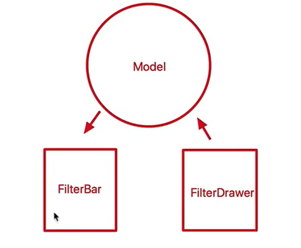
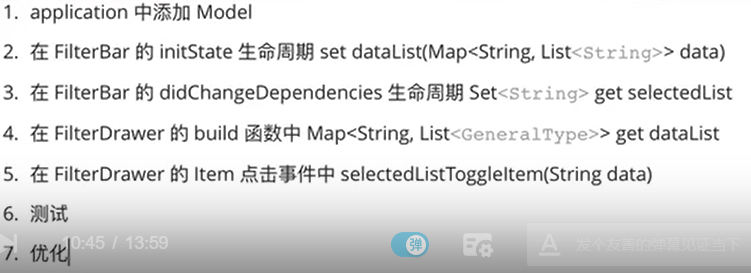

```dart
// 封装模型
class ScopedModelHelper {
  static T getModel<T extends Model>(BuildContext context) {
    return ScopedModel.of<T>(context, rebuildOnChange: true);
  }
}

// 1. 创建set get方法
class FilterBarModel extends Model {
  List<GeneralType> _roomTypeList = [];
  List<GeneralType> _orientedList = [];
  List<GeneralType> _floorList = [];

  Set<String> _selectedList = Set<String>();

  Map<String, List<GeneralType>> get dataList {
    var result = Map<String, List<GeneralType>>();
    result['roomTypeList'] = _roomTypeList;
    result['orientedList'] = _orientedList;
    result['floorList'] = _floorList;

    return result;
  }

  set dataList(Map<String, List<GeneralType>> data) {
    _roomTypeList = data['roomTypeList'];
    _orientedList = data['orientedList'];
    _floorList = data['floorList'];
    notifyListeners();
  }

// 2. 部署在App上
 child: ScopedModel<FilterBarModel>(
            model: FilterBarModel()


// 3. filterbar 上初始化并且获取数据


_getData() async {
  // 1. 网络获取数据
  // 2. 获取数据传到Scope Model
Map<String, List<GeneralType>> dataList = Map<String, List<GeneralType>>();
    dataList['roomTypeList'] = roomTypeList;
    dataList['orientedList'] = orientedList;
    dataList['floorList'] = floorList;

ScopedModelHelper.getModel<FilterBarModel>(context).dataList = dataList;
}

@override
void initState() {
  //异步获取
    Timer.run(_getData);
    super.initState();
    setState(() {
      rentTypeId = widget.initRentType == null ? '' : widget.initRentType;
    });
  }

 // 3. filterDraw 上初始化并且获取数据


````


## 